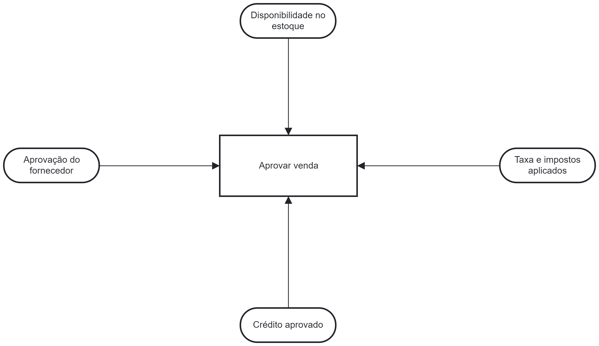
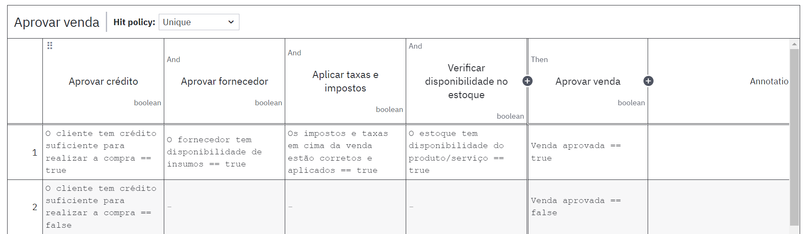
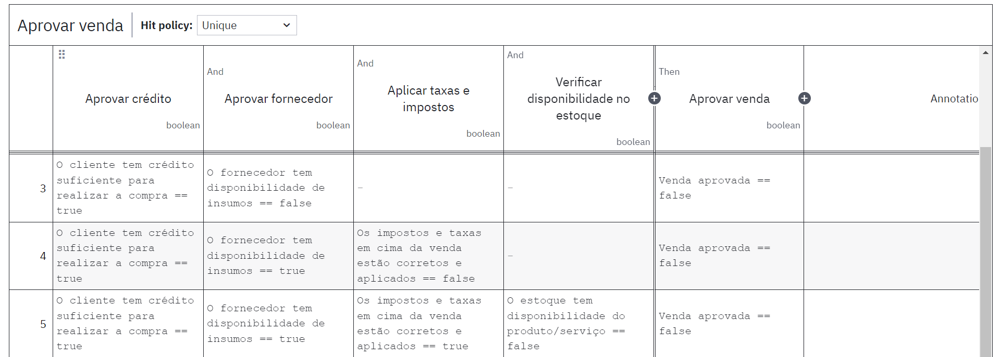

## Ponderada Regras de negócios

1 - Elabore 5 regras de decisão do negócio da empresa do projeto que você está fazendo em linguagem natural (lembre- se de seguir um padrão de linguagem).

2 - Crie um modelo em DMN para uma situação de decisão no processo que seu grupo modelou no projeto no qual um ou mais dessas regras esteja envolvida.

### Regras de negócio:

| Nº | Descrição | Critérios de Aplicação | Ações | Responsável |
|----|-----------|-----------------------|-------|-------------|
| VE001 |   Para realizar a venda é necessário a aprovação de crédito   |   O sistema deve verificar se o cliente possui crédito aprovado   |   Revisar |   Módulo de vendas    |
| VE002 |   Para realizar a venda deve ter as taxas e impostos que serão aplicados  |   O sistema deve calcular e inserir todas as taxas e impostos |   Calcular    |   Módulo de vendas    |
| VE003 |   Para realizar a venda deve haver a aprovação do fornecedor  |   O sistema deve verificar se o fornecedor deu a aprovação necessária |   Revisar | Módulo de vendas  |
| VE004 |   Para realizar a venda é necessário que o cliente confirme o pedido  |   O sistema deve solicitar a confirmação explícita do cliente |   Solicitar   |   Módulo de vendas    |
| VE005 |   Para realizar a venda deve haver disponibilidade no estoque |   O sistema deve verificar a disponibilidade em estoque do produto ou serviço |   Revisar |   Módulo de vendas    |

### Modelo em DMN

#### Decisão:
- Aprovar venda dentro do sistema SAP B1

#### Diagrama DMN:

<b>Figura 1</b> - Diagrama DMN

<b></b>

<b>Figura 2</b> - Tabela de decisão parte 1

<b></b>

<b>Figura 3</b> - Tabela de decisão parte 2

